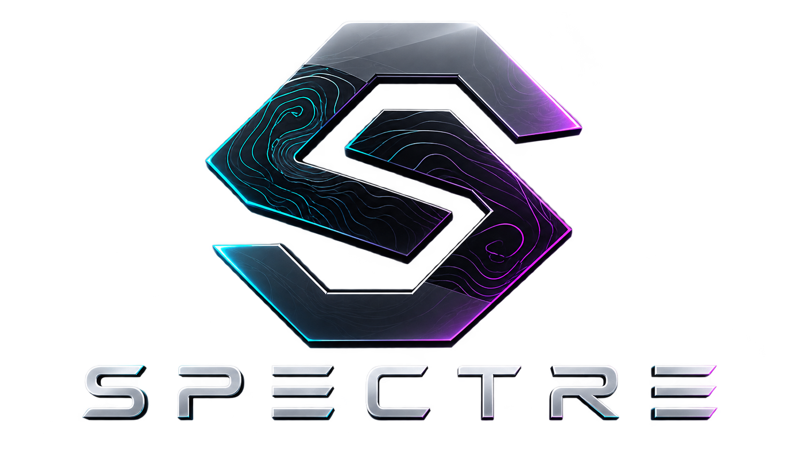

# Spectre Desktop Environment

> **A lightweight, dark and highly customizable Linux desktop environment with a focus on performance, fluid workspaces and subtle cyber-inspired visuals.**

**Status:** Concept / early development  
**Primary platform:** Linux / Wayland  
**Reference distribution:** Garuda Linux  
**Goal:** Run well on both modern gaming/workstation systems and older low-spec hardware.

---

## Overview

**Spectre DE** is a planned desktop environment for Linux inspired by the flexibility of KDE Plasma and the low resource usage of XFCE.

The visual language is primarily **black and minimal**. Instead of excessive neon effects, Spectre uses subtle RGB accents and animated **topographic/contour-line patterns** as a recognizable design element.

Spectre is intended to be distribution-independent. **Garuda Spectre** will be the Garuda Linux configuration/theme, while the core desktop should eventually be usable on Arch Linux, Debian, Ubuntu, Fedora and other Linux distributions.

## Design goals

- **Low RAM and CPU usage** — suitable for old laptops and low-end systems.
- **Modern Wayland desktop** — designed around a native Wayland compositor.
- **Dark by default** — black is the dominant UI color.
- **Subtle RGB** — color is used as an accent, not as visual noise. It lives in
  the pattern rather than in a ring around every window.
- **Spectre Pattern** — animated contour-line patterns inspired by topographic maps.
- **Fluid workspaces** — smooth and optional 3D workspace transitions.
- **Highly customizable** — panel layout, patterns, animations, colors and effects can be changed.
- **Performance scaling** — expensive visual effects can be disabled independently.
- **Distribution independent** — no hard dependency on Garuda-specific components.
- **Cybersecurity-oriented workflow** — efficient keyboard navigation, terminal-friendly design and useful system information without turning the desktop into a gimmick.

---

## Planned architecture

```text
spectre-desktop
│
├── spectre-compositor   # Wayland compositor and window management   [built]
├── spectre-panel        # Taskbar / panel                            [built]
├── spectre-ipc          # Control socket protocol, plus spectrectl   [built]
├── spectre-config       # Configuration model and profiles           [built]
├── spectre-theme        # Palette, metrics and the Spectre Pattern   [built]
├── spectre-text         # Shaping and rasterising labels             [built]
├── spectre-launcher     # Application launcher                       [built]
├── spectre-notify       # Notification daemon / UI                   [built]
├── spectre-draw         # Software canvas for the shell surfaces     [built]
├── spectre-session      # Session startup                            [built]
├── spectre-settings     # Central settings application               [built]
└── spectre-lock         # Lock screen                                [planned]
```

The shell components are ordinary Wayland clients. They learn about the
desktop through `spectre-ipc`, a newline-delimited JSON protocol on a Unix
socket the compositor exports as `$SPECTRE_SOCKET`:

```sh
spectrectl state          # the whole desktop as JSON
spectrectl watch          # ...and again on every change
spectrectl workspace 2
spectrectl profile spectre
```

Spectre should reuse established Linux infrastructure wherever possible instead of reinventing it.

```text
                     Spectre DE
                         │
          ┌──────────────┼──────────────┐
          │              │              │
      Compositor       Panel          Shell
          │              │              │
          └──────────────┼──────────────┘
                         │
                      Wayland
                         │
        ┌────────────────┼────────────────┐
        │                │                │
     PipeWire          BlueZ       NetworkManager
      Audio           Bluetooth       Network
```

## Spectre Panel

The panel is one of the main visual identities of Spectre.

The default design should stay close to the usability of a traditional KDE-style taskbar while improving its appearance and workspace interaction.

Planned features include:

- Application launcher, opened from the Spectre mark in the panel's corner
- Pinned and running applications
- System tray
- Clock and date
- Audio, network, Bluetooth and power controls
- Virtual desktop/workspace indicator
- Optional CPU, RAM and network information
- Modular/reorderable widgets
- Floating or full-width modes
- Optional transparency
- Subtle contour-line background
- Small RGB accent for the active workspace/application

The panel should remain functional with **all animations and RGB effects disabled**.

---

## Workspace experience

Workspace switching is intended to become one of Spectre's signature features.

Instead of a GNOME-style overview being required for every switch, Spectre
provides fast normal switching plus optional visual transitions:

- Slide — the default
- Fade
- Depth — slide plus a scale-back, so the workspaces read as layers
- Cube / 3D — not implemented; runs as Depth for now
- Coverflow-inspired transition — likewise
- No animation

Cube and Coverflow need each workspace rendered to its own texture and mapped
onto a perspective-projected quad, which the flat element pipeline cannot
express. Rather than doing nothing when one is selected, they animate as Depth:
the user asked for motion and gets motion, just not the shape they picked.

Effects must never be mandatory. Users on old hardware should be able to disable them completely.

## Spectre Pattern

A recurring contour/topographic-line pattern will appear subtly in areas such as:

- Window title bars
- Panel backgrounds
- Workspace transitions
- Launcher
- Lock screen
- Optional desktop background

Example settings concept:

```text
Appearance → Spectre Pattern

Pattern                 Topographic
Move the lines          On / Off
Line speed              ━━━━━●━━
Animate the RGB         On / Off
RGB speed               ━━━●━━━━
Intensity               ━━━━●━━━
```

When animation is disabled, the pattern should become static rather than disappear.

---

## Performance profiles

Spectre should offer simple presets while still allowing individual settings to be changed.

### Performance

For old laptops, VMs and low-power hardware.

- Static patterns
- Minimal shadows
- Simple workspace transitions
- No blur
- No animated RGB
- No 3D workspace effects

### Balanced

The intended default.

- Subtle patterns, drawn but held still
- Lightweight RGB accents
- Smooth workspace transitions
- Limited transparency/effects

Patterns are static here rather than animated, and that is a deliberate
change from the original sketch. Animating a pattern means compositing a new
frame every vblank for the whole output, forever, to move a texture at 14%
opacity. On the low-end hardware this project treats as a first-class target
that is a bad trade, and it contradicts principle 1. Motion lives in the
Spectre profile, and `profile = "custom"` turns it on anywhere.

### Spectre

For modern hardware.

- Animated contour patterns
- RGB window accents
- Blur and transparency
- 3D workspace transitions
- Enhanced window animations

Performance profiles must only affect visual features — **never basic desktop functionality**.

---

## Technology direction

- **Rust** for every Spectre component.
- **Wayland** as the primary display protocol, via [Smithay](https://github.com/Smithay/smithay).
  `spectre-compositor` is a compositor in its own right rather than a
  configuration of somebody else's, which is what makes server-side
  decorations, the pattern shader and the workspace transitions possible.
- Two backends from the same state: `udev` (KMS/DRM, libinput, libseat) for the
  real session, and `winit` for running Spectre nested inside another session
  during development.
- GPU shaders (GLSL ES 1.00, no derivative extensions) for the animated
  patterns, so they still run on software GL and old integrated chips.
- Standard freedesktop.org protocols wherever possible.

### Measured so far

Garuda Linux in VirtualBox, 4 cores, 4 GB RAM, VMSVGA, one 1920x991 output:

```text
spectre-compositor       65 MB PSS (about 20 MB private, the rest shared GL)
spectre-panel             9 MB PSS
spectre-notify            9 MB PSS
whole system, idle      472 MB including kernel, systemd and NetworkManager
CPU, idle                0 %, nothing is drawn and nothing wakes up unless
                         something actually changed
during an animation      one frame per refresh period, no more
```

The panel is software rendered on purpose. At 1920x32 the surface is a
quarter of a megabyte; a GL context would cost more memory than the pixels it
would be drawing.

X11 compatibility may be provided through **XWayland** rather than maintaining a separate X11 desktop implementation.

## Distribution support

The long-term goal is native packages for multiple distributions.

```text
Arch Linux / Garuda     spectre-desktop package
Debian / Ubuntu         spectre-desktop .deb
Fedora                   spectre-desktop .rpm
```

After installation, Spectre should appear as a normal session in compatible display managers alongside Plasma, GNOME, XFCE and other environments.

## What Spectre will NOT reinvent

Spectre does not need its own implementation of every Linux subsystem.

Existing projects can provide functionality such as:

- Networking — NetworkManager
- Audio — PipeWire / WirePlumber
- Bluetooth — BlueZ
- Authentication — Polkit
- X11 application compatibility — XWayland

A dedicated Spectre file manager, terminal or other applications may be considered later, but they are **not required for the first desktop release**.

---

## Roadmap

### Phase 0 — Design

- [x] Define visual direction
- [x] Define initial panel concepts
- [x] Define Spectre Pattern concept
- [ ] Finalize UI design system
- [x] Define RAM/CPU performance targets
- [x] Choose compositor foundation and primary language

### Phase 1 — Panel prototype

- [x] Create `spectre-panel`
- [x] Application launcher button
- [x] Workspace indicator
- [x] Running applications
- [ ] Pinned applications
- [ ] System tray
- [x] Clock
- [x] Configuration file
- [x] Static Spectre Pattern

### Phase 2 — Core desktop

- [x] Create compositor prototype
- [x] Window management
- [x] Keyboard shortcuts
- [x] Multi-monitor support
- [x] Resolution and scale settings
- [x] Shell integration
- [x] Notifications
- [x] Session management

### Phase 3 — Spectre visuals

- [x] Rounded, pattern-carrying window decorations
- [x] Animated contour patterns
- [x] Live RGB colour cycling
- [x] Wallpapers
- [x] Workspace animations
- [ ] 3D workspace effects
- [x] Performance profiles
- [x] Animation kill-switch

### Phase 4 — Distribution

- [ ] Arch package
- [ ] Garuda package/repository
- [ ] Debian/Ubuntu package
- [ ] Fedora package
- [ ] Installation documentation

---

## Project principles

1. **Performance before effects.**
2. **Every expensive animation must be optional.**
3. **Black first, RGB second.**
4. **Do not sacrifice usability for the cyber aesthetic.**
5. **Use Linux standards instead of unnecessary custom replacements.**
6. **Old hardware is a supported target, not an afterthought.**
7. **Spectre must remain usable without any visual effects.**

## Current status

A usable desktop, in the sense that you can log into it and work.

`spectre-compositor` runs as a real Wayland session on KMS/DRM. It maps
windows with server-side title bars - caption, minimize, maximize and close,
drag to move, double click to maximize - rounds their corners in a shader,
draws the topographic pattern across the title bar, routes keyboard and
pointer input, draws the pointer itself, handles four workspaces, draws the
wallpaper and survives VT switching. `spectre-panel` sits at the bottom with
the Spectre mark, the workspace indicator, running applications, a CPU and
memory readout and the clock. Clients report it as `WM: spectre-compositor (Wayland)`.

`spectre-launcher` is the application menu: tap the logo key on its own, press
`Mod+D`, or click the Spectre mark. It rises out of the corner the mark sits
in, above the panel. It lists everything installed under the
freedesktop categories, and typing searches across all of them.

`spectre-settings` opens on `Mod+,`. Display, appearance, the Spectre Pattern,
effects and the panel, including the wallpaper picker and the resolution, whose
list comes from the modes the display actually reports. Every change is written to the
configuration file and applied to the running session immediately over the
control socket. `spectre-notify` implements
`org.freedesktop.Notifications`, so anything on the system that notifies -
`notify-send`, a browser, a backup script - appears in the top-right corner.
Urgency shows in the accent bar, and critical notifications stay until they
are clicked away.

Workspace switches animate, and the pattern's colours travel along the accent
whether or not the contour lines themselves move - the cheap half of the
animation, kept on by default. `Mod+Shift+A` stops every animation on the spot,
and `Mod+Shift+P` cycles the performance profile without restarting anything.

Next: a system tray and the lock screen.

### Building

```sh
cargo build --release
./target/release/spectre-compositor --backend winit   # nested, for development
./target/release/spectre-compositor --backend udev    # real session, from a TTY
./target/release/spectre-panel                        # from inside the session
./target/release/spectre-launcher                     # or tap the logo key
./target/release/spectre-settings                     # or press Mod+,
```

`spectre-panel` and `spectre-notify` are started by the session automatically;
set `[panel] enabled = false` to run a different panel.

### Default key bindings

```text
Mod+Return        Terminal
Mod               Application menu (tap the logo key on its own)
Mod+D             Application menu
Mod+,             Settings
Mod+Q             Close window
Mod+F             Fullscreen
Mod+M             Maximize
Mod+Tab           Next window (minimized ones included)
Mod+1..9          Switch workspace
Mod+Shift+1..9    Move window to workspace
Mod+arrows        Focus in a direction
Mod+Shift+arrows  Move the window
Mod+Shift+A       Animation kill switch
Mod+Shift+P       Cycle performance profile
Mod+Shift+Q       End the session
```

The `udev` backend needs `seatd` running (or logind) and the user in the `seat`
group. Copy `spectre-session/share/spectre/spectre.toml` to
`~/.config/spectre/spectre.toml` to change anything; every key is optional.

## Naming

- **Project:** Spectre Desktop Environment
- **Short name:** Spectre DE
- **Garuda configuration/theme:** Garuda Spectre

This separation allows Spectre to remain usable outside Garuda Linux while retaining a dedicated Garuda experience.

---

## License

**TBD.** An open-source license will be selected before the first public source release.

---
There will be no AI that created all of this.
Art cannot be made by an AI...
<p align="center">
  <strong>SPECTRE DE</strong><br>
  Lightweight. Dark. Fluid.
</p>
